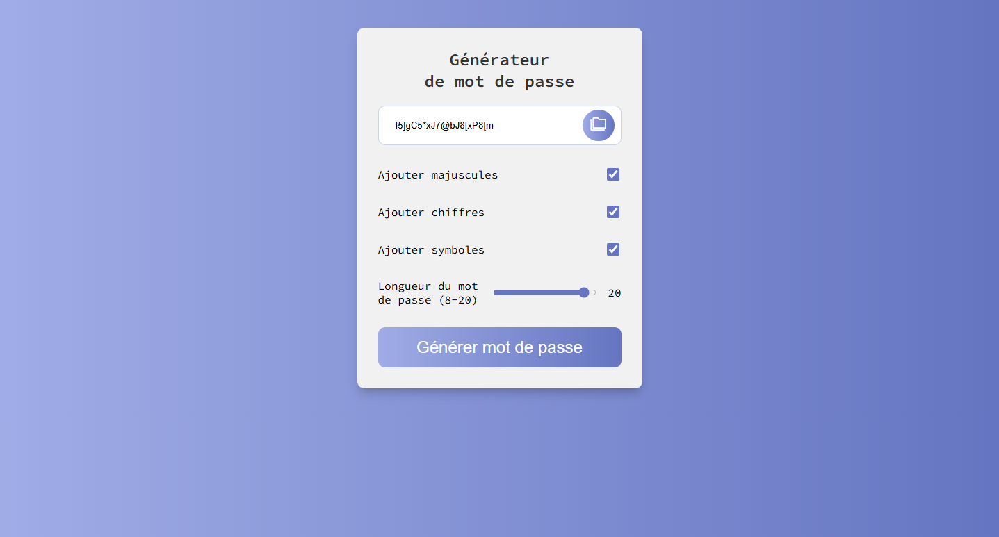

# Générateur de Mot de Passe

Ce projet est une application web simple qui génère des mots de passe sécurisés en fonction des critères sélectionnés par l'utilisateur. L'application permet de choisir la longueur du mot de passe ainsi que d'inclure ou non des majuscules, des chiffres et des symboles.

## Fonctionnalités

- Génération de mots de passe sécurisés
- Choix de la longueur du mot de passe (entre 8 et 20 caractères)
- Inclusion optionnelle de majuscules, chiffres et symboles
- Copie du mot de passe généré dans le presse-papiers

## Aperçu



## Technologies utilisées
- HTML5
- CSS3
- JavaScript

## Installation

1. Clonez le dépôt sur votre machine locale :
    ```sh
    git clone https://github.com/Github-MitchD/password-generator-js-2.git
    ```

2. Ouvrez le fichier `index.html` dans votre navigateur pour voir le générateur de mot de passe en action.

## Structure du Projet

Le projet est structuré comme suit :

- `index.html` : Le fichier HTML principal qui contient la structure de l'application.
- `script.js` : Le fichier JavaScript qui contient la logique de génération de mots de passe et les interactions utilisateur.
- `style.css` : Le fichier CSS qui contient les styles de l'application.

## Utilisation

1. Ouvrez le fichier `index.html` dans un navigateur web.
2. Sélectionnez les critères de votre mot de passe (longueur, majuscules, chiffres, symboles).
3. Cliquez sur `Générer mot de passe` pour générer un mot de passe.
4. Cliquez sur l'icône de `copie` pour copier le mot de passe généré dans le presse-papiers.

## Contributions

Les contributions sont les bienvenues ! Si vous avez des idées d'améliorations ou des bugs à signaler, n'hésitez pas à ouvrir une issue ou à soumettre une pull request.

## Licence

Ce projet est sous licence MIT. Voir le fichier LICENSE pour plus de détails.

---

Développé avec ❤️ par [Michel dufour](https://micheldufour.fr/)